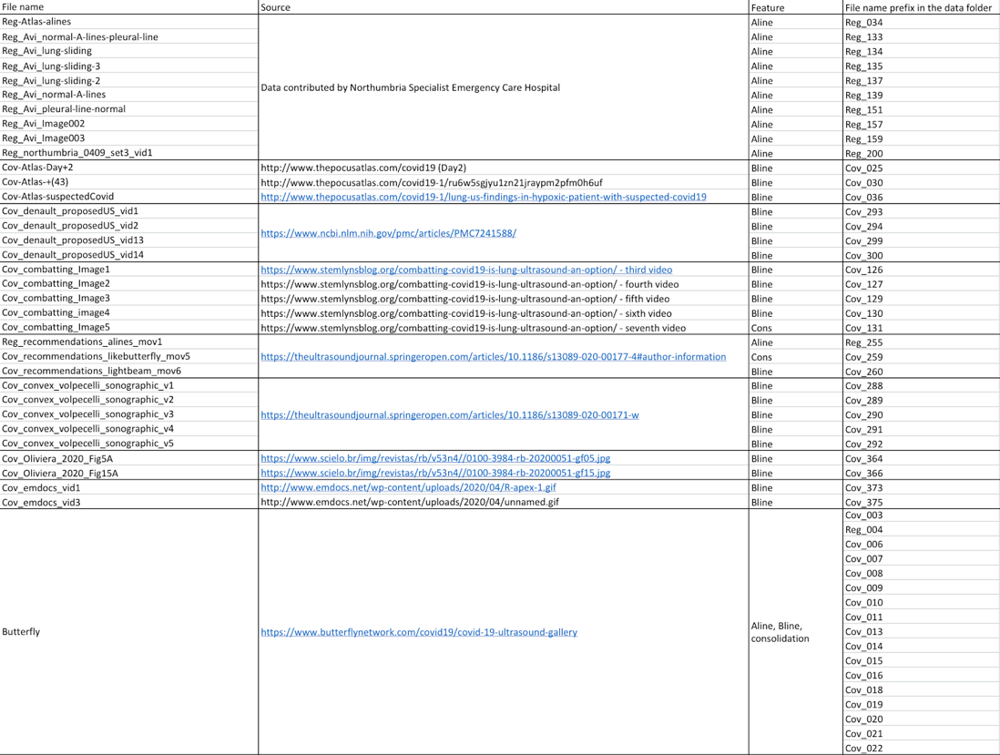

# Pulse Lab Repository Containing Simulated and Labeled In Vivo COVID-19 Dataset

## Repository link: 
https://gitlab.com/pulselab/covid19

This external repository link provides public access to the datasets and code described in the paper “Detection of COVID-19 features in lung ultrasound images using deep neural networks.” Communications Medicine, 2024. https://www.nature.com/articles/s43856-024-00463-5.

Access includes 40,000 carefully simulated lung ultrasound B-mode images containing A-line, B-line, and consolidation features with paired ground truth segmentations. The simulation code can be accessed via the repository. 

Access also includes segmentation annotations (i.e., labels) of the following publicly available POCUS datasets (available in https://github.com/jannisborn/covid19_ultrasound):

	
	 

If you use the simulated datasets, labels, and/or code in this external repository, you must cite the following references:

L. Zhao, T.C. Fong, M.A.L. Bell, “Detection of COVID-19 features in lung ultrasound images using deep neural networks”, Communications Medicine, 2024. https://www.nature.com/articles/s43856-024-00463-5

L. Zhao, M.A.L. Bell (2023). Code for the paper “Detection of COVID-19 features in lung ultrasound images using deep neural networks”. Zenodo. https://doi.org/10.5281/zenodo.10324042
