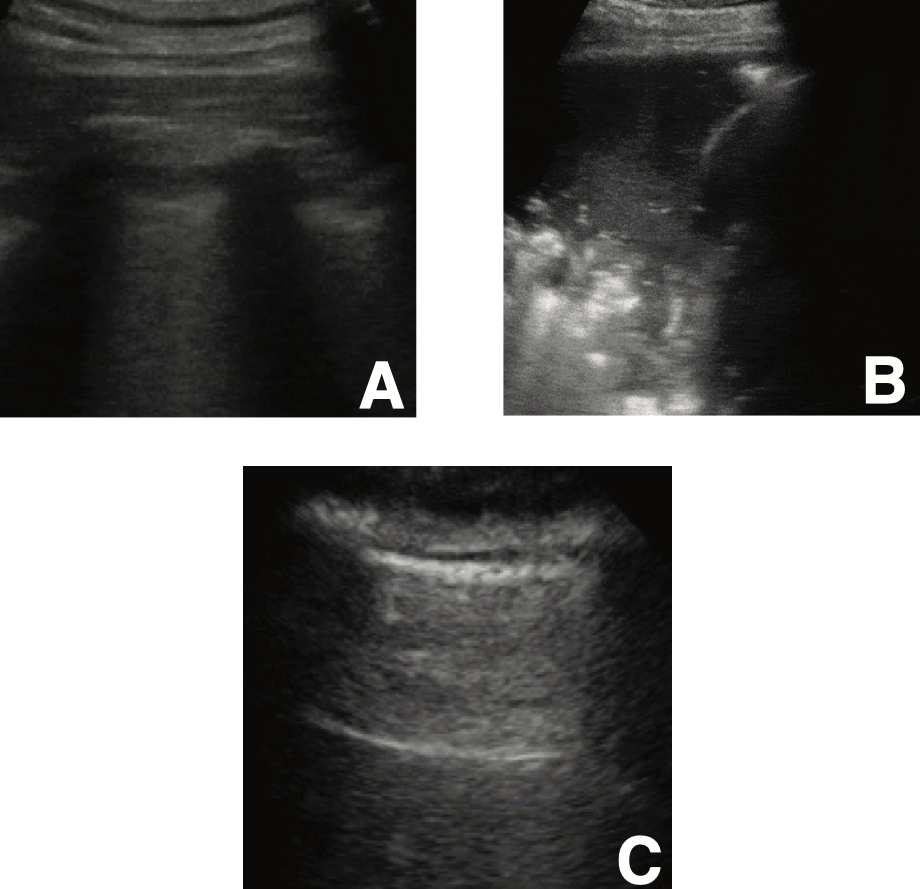

# COVID Ultrasound data collection initiative

#### Here, we gather ultrasound data from human lungs, especially from COVID 19 patients. Detecting COVID-19 from POCUS is challenging and time-consuming, even for trained medical doctors. Since the time of doctors is scarce, there is an urgent need to simplify, fasten & automatize the detection of COVID-19, especially non-invasively.  

<p align="center">
	
	<br>
   <em>Example lung ultrasound images. (A): A typical COVID-19 infected lung, showing small subpleural consolidation and pleural irregularities. (B): A pneumonia infected lung, with dynamic air bronchograms surrounded by alveolar consolidation. (C) Healthy lung. 
The lung is normally aerated with horizontal A-lines.</em>
</p>


## Contribute!
- Please help finding publications with ultrasound images/videos, in particular from
  *healthy* lungs (at the moment we have *more* data for COVID than for healthy
  lungs)
   - Open issues in this repository and paste links to publications (please
     check [here TODO]() before whether the data is already in the dataset)
   - 

## Learn more about the project

- [arXiv Paper (Coming)](https://devpost.com/software/automatic-detection-of-covid-19-from-pocus-ultrasound-data)
- [Web Interface (POCOVIDScreen)](https://pocovidscreen.org)
- [DevPost](https://devpost.com/software/automatic-detection-of-covid-19-from-pocus-ultrasound-data)   
- Watch this video (2min pitch):
[](https://www.youtube.com/watch?v=UY34-d_yHwo& "POCUS 4 COVID19")


## Here is the current performance of our model (POCUS-splitted data):


### COVID
.gif_frame40.jpg)  
### Pneunomia

### Sane


## Installation of and Training

Find all details on how to get started in [pocovidnet](pocovidnet/README.md)
To run the code, just install the package `pocovidnet` in editable mode:

```sh
git clone https://github.com/jannisborn/covid19_pocus_ultrasound.git
cd covid19_pocus_ultrasound
pip install -e .
```


# Contact 
- If you experience problems with the code, please open an
[issue](https://github.com/jannisborn/covid19_pocus_ultrasound/issues).
- If you have questions about the project, please reach out: `jborn@ethz.ch`.


# Citation

The paper is available [here](TODO)

If you build upon our work or find it useful, please cite our paper:
```bib
@article{TODO}
```
