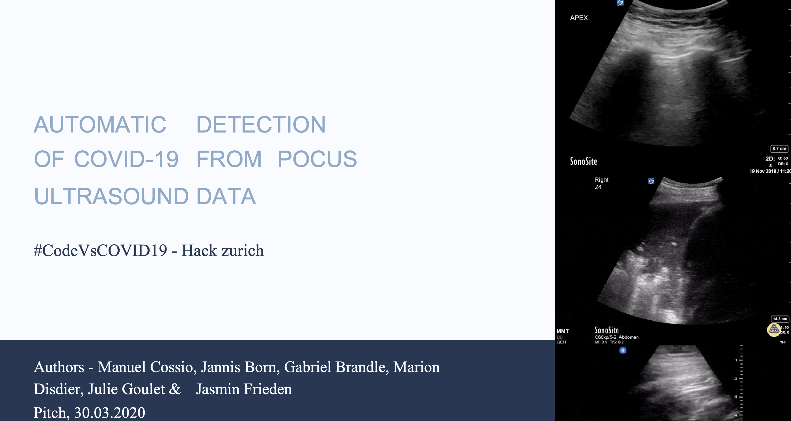

# Automatic Detection of COVID-19 from **Ultrasound** Data

We develop a **computer vision** approach for the diagnosis of **COVID-19** infections
from **Point-of-care Ultrasound** (POCUS) recordings. This is the **first
approach to automatically detect COVID-19 from ultrasound**. Next to the code
for our model and our [website](https://pocovidscreen.org), we also make a
**dataset**
available. This complements the current data collection initiaves that only focus
on CT or X-Ray data. The data includes a total of ~60 videos of COVID 19 patients, as well
as pneumonia and healthy lungs. 
**Please help growing the database!**


## Motivation:
Ultrasound has not gained much attention in the context of COVID-19 so far, in contrast to CT and X-Ray scanning.
However,  ultrasound data was shown to be highly
[**correlated with CT**](https://www.ncbi.nlm.nih.gov/pmc/articles/PMC7165267/), the gold standard for lung diseases. Instead of CT,
ultrasound is **non-invasive**, **cheap**, **portable** (bedside execution),
**repeatable** and **available everywhere**. But even for trained MDs detecting COVID-19 from ultrasound data is challenging
and time-consuming. Since their time is scarce, there is an urgent need to simplify, fasten & automatize the detection of COVID-19.

This project is a **proof of concept**, showing that a CNN is able to learn to distinguish between COVID-19,
Pneumonia and healthy patients with an **accuracy of 89%** and **sensitivity for
COVID of 96\%**.

### Evidence (Why ultrasound)
   - Peer-reviewed publications from the medical community suggesting to use more **ultrasound
     for COVID-19**:
      - [The Lancet respiratory medicine (Impact factor
        22)](https://www.thelancet.com/journals/lanres/article/PIIS2213-2600(20)30120-X/fulltext?fbclid=IwAR2kDbxpYTSjoj3Nl_B-nOhLZL66mQLUBVBCdzn6zEG5ObLKq9oXhPZDXHQ)
      - [Anaesthesia](https://onlinelibrary.wiley.com/doi/abs/10.1111/anae.15082)
      - [Journal of
        Ultrasound](https://www.ncbi.nlm.nih.gov/pmc/articles/PMC7159975/)
      - [Journal of ultrasound in medicine](https://onlinelibrary.wiley.com/doi/full/10.1002/jum.15284)
   - Ultrasound can evidence the same symptoms as CT [Point-by-point correspondance of CT
     and ultrasound findings through COVID-19 disease process](https://www.ncbi.nlm.nih.gov/pmc/articles/PMC7165267/) 
   - [NIH launched an initiative to use POCUS for risk stratificaton of COVID-19
     patients.](https://clinicaltrials.gov/ct2/show/NCT04338100)
   - [**Read our full paper** (Coming..)]()

<p align="center">
	
	<br>
   <em>Example lung ultrasound images. (A): A typical COVID-19 infected lung, showing small subpleural consolidation and pleural irregularities. (B): A pneumonia infected lung, with dynamic air bronchograms surrounded by alveolar consolidation. (C) Healthy lung. 
The lung is normally aerated with horizontal A-lines.</em>
</p>


## Contribute!
- You can donate your lung ultrasound recordings directly on our website: [](https://pocovidscreen.org)
- Please help us to find more data! Open an
  [issue](https://github.com/jannisborn/covid19_pocus_ultrasound/issues) if you
  identified a promising data source. Please check [here](https://docs.google.com/spreadsheets/d/1t-tLMjMod6W-nAjkuxmO0CLsiyalFIOp92k_XD_yeo8/edit#gid=1181682638) whether the data is
  already included. Useful contributions are:
   - Publications with ultrasound images/videos
   - Images/Videos that are available via Creative Commens license (e.g. CC
     BY-NC-SA) in the web or on YouTube.
   - Possible sources are:
      - https://thepocusatlas.com
      - https://radiopaedia.org/
      - https://grepmed.com 
- We are mostly looking for *healthy* lung recordings (at the moment we have *more* data for COVID than for healthy
  lungs)


## Learn more about the project

- [arXiv Paper (Coming)](https://devpost.com/software/automatic-detection-of-covid-19-from-pocus-ultrasound-data)
- Web Interface([https://pocovidscreen.org)](https://pocovidscreen.org))
- [DevPost](https://devpost.com/software/automatic-detection-of-covid-19-from-pocus-ultrasound-data)   
- Watch this [video](https://www.youtube.com/watch?v=UY34-d_yHwo&) (2min pitch):
[](https://www.youtube.com/watch?v=UY34-d_yHwo& "POCUS 4 COVID19")


## Installation and Training

Find all details on how to get started in the [pocovidnet](pocovidnet/README.md)
folder.
To run the code, just clone the repo and install the package `pocovidnet` in editable mode:

```sh
git clone https://github.com/jannisborn/covid19_pocus_ultrasound.git
cd covid19_pocus_ultrasound
pip install -e .
```


# Contact 
- If you experience problems with the code, please open an
[issue](https://github.com/jannisborn/covid19_pocus_ultrasound/issues).
- If you have questions about the project, please reach out: `jborn@ethz.ch`.


# Citation

The paper is available [here](TODO)

If you build upon our work or find it useful, please cite our paper:
```bib
@article{TODO}
```
