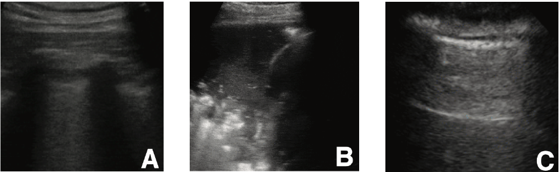

# **Automatic Detection of COVID-19 from *Ultrasound* Data**


[](https://travis-ci.com/jannisborn/covid19_pocus_ultrasound)

This is an ultrasound data collection initiative for COVID-19. Please help growing the database or contribute new models.

We develop a **computer vision** approach for the diagnosis of **COVID-19** infections
from **Point-of-care Ultrasound** (POCUS) recordings. Find the arXiv preprint
[here](https://arxiv.org/abs/2004.12084). This is the **first
approach to automatically detect COVID-19 from ultrasound**. Next to the code
for our model and our website on [https://pocovidscreen.org](https://pocovidscreen.org), we also make a
**dataset** available. This complements the current data collection initiaves that only focus
on CT or X-Ray data. The data includes a total of >200 videos and >60 images of 3 classes (COVID-19, pneumonia, healthy lungs). With frame-based prediction models this easily makes up for a dataset of thousands of images.
**Please help growing the database!**


## Motivation:
From the machine learning community, ultrasound has not gained much attention in the context of COVID-19 so far, in contrast to CT and X-Ray imaging.
Many voices from the medical community, however, have advocated for a more prominent role of ultrasound in the current pandemic (details below).
#### Why imaging?
Biomedical imaging has the potential to complement conventional diagnostic procedures for COVID (such as RT-PCR or immuno assays). It can provide a fast assessment and guide downstream diagnostic tests, in particular in triage situations or low-resource settings. 
Although RT-PCR has a sensitivity that is not higher than 80% for any moment in time after infection [(Kucirka et al., Annals of Internal Medicine)](https://www.acpjournals.org/doi/full/10.7326/M20-1495), it is the sole recommendation for COVID-19 diagnosis according to the ACR. Several studies reported that CT imaging can detect COVID-19 at higher sensitivity rate compared to RT-PCR (98% vs 71%, [Fang et. al., 2020](https://pubs.rsna.org/doi/full/10.1148/radiol.2020200432) and 88% vs. 59% [Ai et. al., 2020](https://pubs.rsna.org/doi/full/10.1148/radiol.2020200642)). In any case: Even if sensitivity of PCR would be 100%, we have to recognize that both PCR and CT are not available to the majority of the world's population. 
This calls into play surrogate imaging modalities (chest X-Ray and lung ultrasound) to rapidly screen and stratify COVID-19 suspects.

#### Why ultrasound?
Ultrasound data was shown to be highly
[**correlated with CT**](https://www.ncbi.nlm.nih.gov/pmc/articles/PMC7165267/), the gold standard for lung diseases. Instead of CT,
ultrasound is **non-invasive**, **cheap**, **portable** (bedside execution),
**repeatable** and **available in almost all medical facilities**. But even for
trained doctors detecting COVID-19 from ultrasound data is challenging and
time-consuming. Since their time is scarce, there is an urgent need to simplify,
fasten & automatize the detection of COVID-19.

This project is a **proof of concept**, showing that a CNN is able to learn to distinguish between COVID-19,
Pneumonia and healthy patients with an **accuracy of 89%** and **sensitivity for
COVID of 96\%**. This is by no means clinically relevant and a lot of further
work needs to be done, e.g. on differentiating COVID from other viral pneumonias.

#### Evidence for ultrasound
   - [LUS is more sensitive than X-Ray in diagnosing COVID-19](https://www.ncbi.nlm.nih.gov/pmc/articles/PMC7390587/) 
   - Advocacy for lung ultrasound for the COVID-19 pandemic:
      - ["COVID-19 outbreak: less stethoscope, more ultrasound" in *The Lancet
        respiratory medicine* (IF:
        22)](https://www.thelancet.com/journals/lanres/article/PIIS2213-2600(20)30120-X/fulltext?fbclid=IwAR2kDbxpYTSjoj3Nl_B-nOhLZL66mQLUBVBCdzn6zEG5ObLKq9oXhPZDXHQ)
      - [[Smith et. al., 2020] in *Anaesthesia*](https://onlinelibrary.wiley.com/doi/abs/10.1111/anae.15082)
      - [[Sofia et. al., 2020] *Journal of
        Ultrasound*](https://www.ncbi.nlm.nih.gov/pmc/articles/PMC7159975/)
      - [[Soldati et. al., 2020] in *Journal of ultrasound in medicine*](https://onlinelibrary.wiley.com/doi/full/10.1002/jum.15284)
   - Ultrasound can evidence the same symptoms as CT: ([Point-by-point correspondance of CT
     and ultrasound findings through COVID-19 disease process](https://www.ncbi.nlm.nih.gov/pmc/articles/PMC7165267/)) 

<p align="center">
	
	<br>
   <em>Example lung ultrasound images. (A): A typical COVID-19 infected lung, showing small subpleural consolidation and pleural irregularities. (B): A pneumonia infected lung, with dynamic air bronchograms surrounded by alveolar consolidation. (C) Healthy lung. 
The lung is normally aerated with horizontal A-lines.</em>
</p>


## Contribute!
- Please help us to find more data! Open an
  [issue](https://github.com/jannisborn/covid19_pocus_ultrasound/issues) if you
  identified a promising data source. Please check [here](https://docs.google.com/spreadsheets/d/1t-tLMjMod6W-nAjkuxmO0CLsiyalFIOp92k_XD_yeo8/edit#gid=1181682638) whether the data is
  already included. Useful contributions are:
   - Publications with ultrasound recordings
   - Images/Videos that are available via Creative Commens license (e.g. CC
     BY-NC-SA) in the web or on YouTube.
   - Possible sources are:
      - https://thepocusatlas.com
      - https://radiopaedia.org/
      - https://grepmed.com 
- You can donate your lung ultrasound recordings directly on our website: [https://pocovidscreen.org](https://pocovidscreen.org)


## Learn more about the project
- [**Read our new manuscript**](https://arxiv.org/abs/2004.12084)
- Web Interface ([https://pocovidscreen.org](https://pocovidscreen.org))
- Read our [blogpost](https://towardsdatascience.com/ultrasound-for-covid-19-a-deep-learning-approach-f7906002892a)
- [DevPost](https://devpost.com/software/automatic-detection-of-covid-19-from-pocus-ultrasound-data)   
- Watch this [video](https://www.youtube.com/watch?v=qOayWwYTPOs) (3min pitch)
- [Here](https://arxiv.org/abs/2004.12084) is our first manuscript from spring, *POCOVID-Net*.
  
## Installation 

### Ultrasound data
Find all details on the current state of the database in the [data](data)
folder.

### Deep learning model (`pocovidnet`)
Find all details on how to reproduce our experiments and train your models on
ultrasound data in the [pocovidnet](pocovidnet) folder.

### Web interface (`pocovidscreen`)
Find all details on how to get started in the [pocovidscreen](pocovidscreen)
folder.

## Current results

Current results of `POCOVID-Net` were obtained in a 5-fold CV and show an accuracy of 0.89 (balanced accuracy 0.82) across all 3
classes. For COVID-19, we achieve a sensitivity of 96%.


Detailed performances:


## Contact 
- If you experience problems with the code, please open an
[issue](https://github.com/jannisborn/covid19_pocus_ultrasound/issues).
- If you have questions about the project, please reach out: `jborn@ethz.ch`.


## Citation
The paper is available [here](https://arxiv.org/abs/2009.06116).

If you build upon our work or find it useful, please cite our paper:
```bib
@article{born2020accelerating,
  title={Accelerating COVID-19 Differential Diagnosis with Explainable Ultrasound Image Analysis},
  author={Born, Jannis and Wiedemann, Nina and Br{\"a}ndle, Gabriel and Buhre, Charlotte and Rieck, Bastian and Borgwardt, Karsten},
  journal={arXiv preprint arXiv:2009.06116},
  year={2020}
}

@article{born2020pocovid,
  title={POCOVID-Net: Automatic Detection of COVID-19 From a New Lung Ultrasound Imaging Dataset (POCUS)},
  author={Born, Jannis and Br{\"a}ndle, Gabriel and Cossio, Manuel and Disdier, Marion and Goulet, Julie and Roulin, J{\'e}r{\'e}mie and Wiedemann, Nina},
  journal={arXiv preprint arXiv:2004.12084},
  year={2020}
}
```
