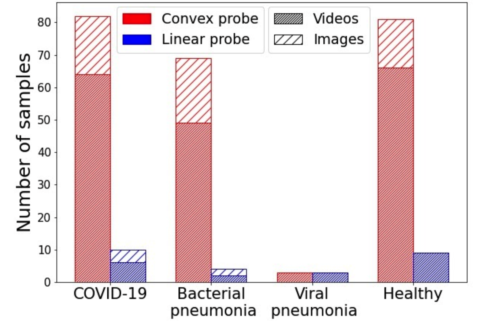
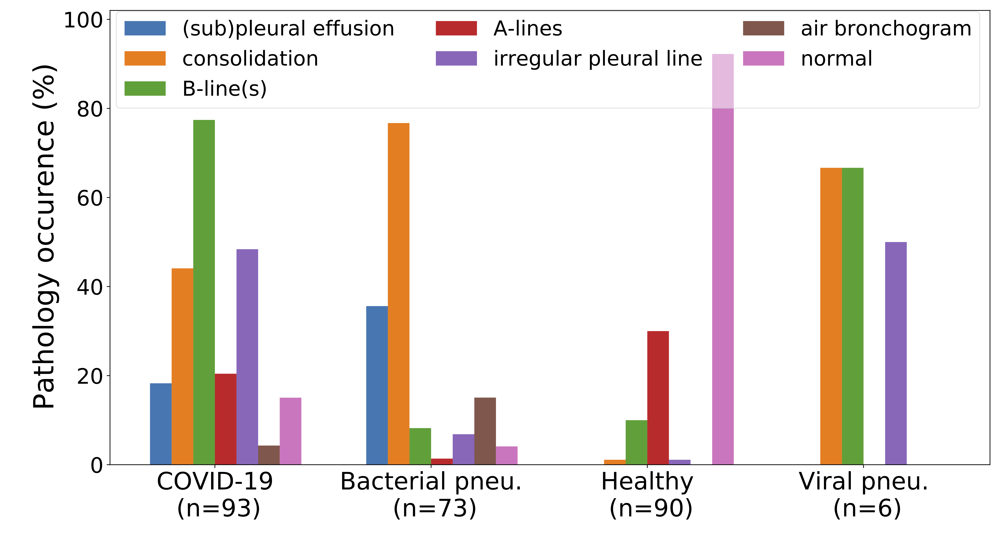
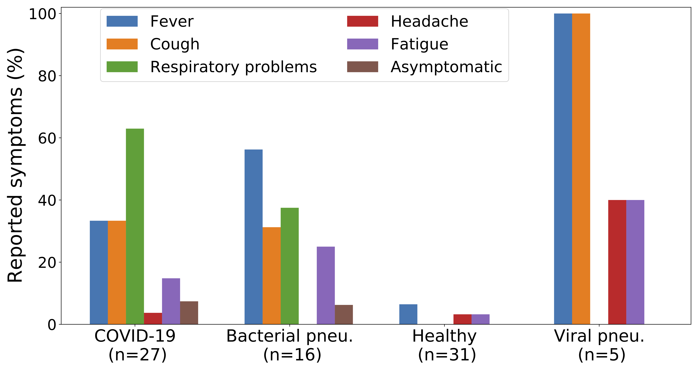
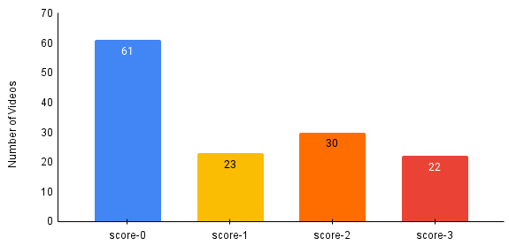

# COVID-19 Lung ultrasound dataset

We build a dataset of lung ultrasound images and videos. The dataset combines data from collaborating hospitals as well as publicly available resources from the web (e.g. publications and educational websites).

## Train/test split
**Due to multiple papers that used our dataset incorrectly, we are adding the following disclaimer: Please make sure to create a meaningful train/test data split. Do not split the data on a frame-level, but on a video/patient-level. The task becomes trivial otherwise because consecutive LUS frames are extremely correlated. We provide scripts to create a cross-validation split for you. See the instructions [here](../pocovidnet/#cross-validation-splitting).**

## Current dataset size (January 2021)
<p align="center">
	
	<br>
   <em>Current size of the dataset. Most samples use the convex probe. To our knowledge, 
   this is the largest public source of COVID-19 LUS data. 
   </em>
</p>

- Convex:
  - 162 videos (46x COVID, 49x bacterial pneumonia, 64x healthy, 3x viral pneumonia).
  - 20 videos from the Butterfly dataset (18 COVID, 2 healthy).
  - 53 images (18x COVID, 20x bacterial pneumonia, 15x healthy).
- Linear:
  - 20 videos (6x COVID, 2x bacterial pneumonia, 9x healthy, 3x viral pneumonia).
  - 6 images (4x COVID, 2x bacterial pneumonia).
  - 45 videos of *possible* COVID-19 patients collected in Piacenza at the peak of the crisis in Italy; there were not enough PCR tests available, so the label is not clear.

### Statistics on symptoms and LUS patterns
LUS pathologies            |  Symptoms
:-------------------------:|:-------------------------:
  |  


For more information and comments by medical experts, see our [metadata](https://docs.google.com/spreadsheets/d/1t-tLMjMod6W-nAjkuxmO0CLsiyalFIOp92k_XD_yeo8/edit#gid=1181682638) sheet or metadata [csv](dataset_metadata.csv).
The dataset is continuously updated.


## Lung Severity Scores
<!-- Lung Severity Scores       
 -->
<!--  -->
<p align="center">
	
	<!-- <br> -->
   <!-- <em>Current size of the dataset. Most samples use the convex probe. To our knowledge, 
   this is the largest public source of COVID-19 LUS data. 
   </em> -->
</p>

A subset of 136 videos were scored into 4 lung-severity classes as part of work in [Gare et al., 2022. 'Weakly Supervised Contrastive Learning'](https://arxiv.org/abs/2201.07357), by using the scoring scheme as defined in [LUSCOVID19](https://clinicaltrials.gov/ct2/show/record/NCT04322487?term=ultrasound+covid&draw=2&view=record). These severity scores are made available in the [dataset_metadata.csv](./dataset_metadata.csv) under the column **"Lung Severity Score"**.

**Disclamer**: The labels are provided as reference for follow on studies under [`CC BY NC 4.0`](https://creativecommons.org/licenses/by-nc/4.0/) license. Use at your own risk.

If you use these labels, please cite the [Gare et al., 2022](https://arxiv.org/abs/2201.07357) paper using the following bibtex entry:
```bib
@article{Gare2022WeaklyUltrasound,
    author = {Gare, Gautam Rajendrakumar and Tran, Hai V. and deBoisblanc, Bennett P and Rodriguez, Ricardo Luis and Galeotti, John Michael},
    title = {{Weakly Supervised Contrastive Learning for Better Severity Scoring of Lung Ultrasound}},
    year = {2022},
    month = {1},
    publisher = {arXiv},
    url = {https://arxiv.org/abs/2201.07357},
    doi = {10.48550/ARXIV.2201.07357},
    arxivId = {2201.07357}
}
```

## Metadata

The [dataset_metadata.csv](./dataset_metadata.csv) file contains a rich amount of metadata of the dataset. The below table lists the metadata category and the corresponding column names under which the information is listed.

| Metadata Category   |      Column Names |
|----------|:-------------:|
| File source | **Date added**, **Current location**, **Filename**, **URL (Video Name)**|
| Labels | **Label**, **Lung Severity Score**|	
| License Info | **License**, **LinkToLicense**, **ChangesMade**, **InThisRepo**|	
| Probe details | **Type**, **Probe**	| 
| Clinical Observation | **DOI**, **Source ID**, **Comments from web site**, **Title**, **Comments first medical doctor (MD1)**, **MD2**, **MD3**|	
| Video Details | **Framerate**, **Resolution**, **Length (frames)**, **Gender**, **Age**, **Patient ID / Name**, **Lung /abdomen interface**| 
| Patient comments | **Preconditions / Comments about patient**, **Area according to DEGUM**| 
|	Bio-markers | **Effusion**, **Consolidations**, **B-lines**, **A-lines**, **Pleural line irregularities**, **Air bronchogram**|	
| Symptoms | **Healthy**, **Fever**, **Cough**, **Respiratory problems**, **Headache**, **Loss of smell/taste**, **Fatigue**, **Sore throat**, **Asymptomatic**, **Other**|


## Contribute!
- Please help us to find more data! Open an
  [issue](https://github.com/jannisborn/covid19_pocus_ultrasound/issues) if you
  identified a promising data source. Please check [here](https://docs.google.com/spreadsheets/d/1t-tLMjMod6W-nAjkuxmO0CLsiyalFIOp92k_XD_yeo8/edit#gid=1181682638) whether the data is already included.
  Useful contributions are clean lung ultrasound videos available via Creative Commons license, e.g.:
   - Publications with ultrasound videos as electronic supplement
   - Websites like [The Pocus Atlas](https://thepocusatlas.com), [Radiopaedia](https://radiopaedia.org/) or [Liftl](https://litfl.com/ultrasound-library/).
   - Other LUS data available via CC license.

  

## Collect Data from sources without CC license 

**NOTE**: If you use this dataset for your own research, we recommend only using the data directly hosted in this repository.

#### Unlicensed data
Some data used in our [study](https://www.mdpi.com/2076-3417/11/2/672) was obtained from public sources, but cant be redistributed on this repository due to licensing restrictions.
We therefore provide a script `get_and_process_web_data.sh` which users can use to download the data and process it for inclusion and reproduction of our study.
The provided script only works on Unix distributions (**not on Windows!**) and requires that you have python3 installed.

```sh
sh get_and_process_web_data.sh
```
After executing this script, a lot of data will have been added into your local `pocus_images` and `pocus_videos` folder.
Please note that for this freshly added data, all rights are reserved. 

#### Butterfly
To obtain the data from Butterfly please complete the following steps (in addition to executing `get_and_process_web_data.sh`)

**NOTE:** We can not provide a script to crop the butterfly videos and remove artifacts due to data licensing. The following code only selects the videos that we used for our experiments, renames them, and sorts them into the correct folders.

1. Visit the [COVID-19 ultrasound_gallery](https://www.butterflynetwork.com/covid-19#gallery)
   of Butterfly, scroll to *Download Gallery* and download the videos (we accessed this
   source on 17.04.2020 for training our models). Please note that it is not
   under control whether Butterfly will keep this data online. Feel free to
   notify us if you observe any changes).
2. Place the `.zip` folder into the this folder (`data`)
3. `cd` into the `data` folder.
4. Run:
```sh
sh parse_butterfly.sh
```
*NOTE*: This step requires that you installed the `pocovidnet` package
    before (see "Installation").
    
All butterfly videos should have been added to `data/pocus_videos/convex`.


## License Note:
*NOTE 1*: The founders/authors of the repository take no responsibility or liability for the data contributed to this archive. The contributing sites have to ensure that the collection and use of the data fulfills all applicable legal and ethical requirements.

*NOTE 2*: For every source of this dataset, individual licenses apply. Users have the responsibility to verify whether the individual licenses allow the desired usage. We exclude any liability for any of such cases.

*NOTE 3*: For the unlicensed data, users have the responsibility to verify whether their desired usage is allowed. We exclude any liability for any use by others.

### Neuruppin and Northumbria data
All participants consented to be included in the study and agreed to their data being distributed. The data from Neuruppin is licensed under [`CC BY 4.0`](https://creativecommons.org/licenses/by/4.0/). The data contributed from Northumbria hospital is licensed under [`CC BY NC 4.0`](https://creativecommons.org/licenses/by-nc/4.0/).

### Scraped data
All videos/images provided in this repo which were collected from public sources have a license specified in the `dataset_metadata.csv`.
We provide links to the respective licenses and indicate whether (and which) changes were made.


## Updates
- **24.10.2020**: Dataset metadata (patient age, gender, symptoms, ID, etc.) included (see #58).
- **26.9.2020**: Major update to the database: 30 videos from Dr Avinash Aujayeb from Northumbria, and 45 linear videos of COVID-19 patients sponsored by Bolzano AG
- **25.8.2020**: Update - added 10 new videos from the Northumbria hospital
- **12.8.2020**: Update - added 14 new COVID videos from publications
- **28.7.2020**: Update - added 4 new videos and 7 new images from the Northumbria hospital
- **11.7.2020**: Database update - We added an up to date csv file with all metadata, and new videos that were contributed from the Northumbria Specialist Emergency Care Hospital (17 images and 4 videos of healthy patients)
- **22.6.2020**: Database update - We added 46 new videos (18x COVID, 1x bacterial pneumonia, 27x healthy).
- **16.5.2020**: The [ICLUS
  project](https://www.disi.unitn.it/iclus) released ~60 videos
  from COVID-patients (register [here](https://covid19.disi.unitn.it/iclusdb/login)). 


## Add class "uninformative"
In the current state, a user could input any image, e.g. of a house, and still receive a classification result as COVID-19 / pneumonia / healthy.
In order to prevent this, we decided to include a fourth class called "uninformative", where we add Imagenet images and neck-ultrasound data from the Kaggle Nerve Segmentation Challenge.
Download the data [here](https://drive.google.com/open?id=1bAbCJCq-U5vIxbG0ySUKanAW_pW_z2O4) from google drive. It contains a folder *uniform_class_nerves* and one *uniform_class_imagenet*.
The data can be immediately used for training, simply combine it in a folder *uninformative* next to the *covid*, *pneumonia* and *regular* folders.
If you want to add them to an existing cross validation split (e.g after executing [cross_val_splitter](../pocovidnet/scripts/cross_val_splitter.py)), we also provide a script:

Run:
```
python ../pocovidnet/scripts/add_uninformative_class.py -i uniform_class_imagenet -u uniform_class_nerves -o cross_validation -s 5
```

This script will split the data in the *uniform_class_nerves* and *uniform_class_imagenet* folders and add them in a folder *uninformative* to each fold.

## References

### Acknowledgements to contributors
We are deeply thankful to the authors and contributors to our datset, in particular
* Dr Avinash Aujayeb (MBBS MRCP (Edin 2008) PgCert ClinEd FHEA), Pleural Medicine Lead and Consultant in Respiratory and Acute Medicine for the Trustee for Mesothelioma UK and Northumbria Specialist Emergency Care Hospital, who contributes regularly to our database with clinical data. We greatly appreciate their efforts for open-access data.
* Charlotte Buhre for recording data for our dataset.
* The maintainers of https://thepocusatlas.com, https://radiopaedia.org/ and https://litfl.com/ultrasound-library/ for distritbuting their data under a CC license.

### Publications
Also, we obtained videos and images from publications on ultrasound, and we appreciate very much that we could include data from the following publications in our database:

* 3 COVID-19 images from [@inchingolo2020diagnosis] - [The Diagnosis of Pneumonia in a Pregnant Woman with COVID-19 Using Maternal Lung Ultrasound](https://www.ajog.org/action/showPdf?pii=S0002-9378%2820%2930468-3)
* 8 COVID-19 images from [@huang2020preliminary] - [A Preliminary Study on the Ultrasonic Manifestations of Peripulmonary Lesions of Non-Critical Novel Coronavirus Pneumonia (COVID-19)](https://papers.ssrn.com/sol3/papers.cfm?abstract_id=3544750)
* 4 videos (healthy and pneumonia) from [@irwin2016advances] - [Advances in Point-of-Care Thoracic Ultrasound](https://www.sciencedirect.com/science/article/pii/S0733862715000772#appsec2)
* 2 videos (healthy and pneumonia) from [@bouhemad2007clinical] - [Clinical review: Bedside lung ultrasound in critical care practice](https://link.springer.com/article/10.1186/cc5668#Abs1)
* 3 COVID-19 images from [@lomoro2020covid] - [COVID-19 pneumonia manifestations at the admission on chest ultrasound, radiographs, and CT: single-center study and comprehensive radiologic literature review](https://www.sciencedirect.com/science/article/pii/S2352047720300204)
* 2 viral pneumonia videos (H1N1) from [@testa2012early] - [Early recognition of the 2009 pandemic influenza A (H1N1) pneumonia by chest ultrasound](https://link.springer.com/article/10.1186/cc11201)
* 8 COVID-19 videos from [@yassa2020lung] - [Lung Ultrasound Can Influence the Clinical Treatment of Pregnant Women With COVID ‐19](https://onlinelibrary.wiley.com/doi/full/10.1002/jum.15367#jum15367-fig-0001)
* 2 healthy and 1 viral image from [@stadler2017lung] - [Lung ultrasound for the diagnosis of community-acquired pneumonia in children](https://link.springer.com/content/pdf/10.1007/s00247-017-3910-1.pdf)
* 1 healthy and 2 regular images from [@reissig2014lung] - [Lung Ultrasound in Community-Acquired Pneumonia and in Interstitial Lung Diseases](https://www.karger.com/Article/Pdf/357449)
* 4 pneumonia images from [@claes2017performance] - [Performance of chest ultrasound in pediatric pneumonia](https://www.sciencedirect.com/science/article/pii/S0720048X16304260?casa_token=W82e3087RfcAAAAA:plbCnRIJAeD9tj369F72kUDp0vChQMU9CwO0pBJvd6_RKsTSozgLFdPijaG4sFM7m5Auov988b4)
* 4 videos (viral and bacterial pneumonia) from [@tsung2012prospective] - [Prospective application of clinician-performed lung ultrasonography during the 2009 H1N1 influenza A pandemic: distinguishing viral from bacterial pneumonia](https://theultrasoundjournal.springeropen.com/articles/10.1186/2036-7902-4-16)
* 6 videos (COVID-19, healthy, bacterial pneumonia) from [@vieira2020role] - [Role of point-of-care ultrasound during the COVID-19 pandemic: our recommendations in the management of dialytic patients](https://theultrasoundjournal.springeropen.com/articles/10.1186/s13089-020-00177-4)
* 9 COVID-19 images from [@sofia2020thoracic] - [Thoracic ultrasound and SARS-COVID-19: a pictorial essay](https://link.springer.com/content/pdf/10.1007/s40477-020-00458-7.pdf)
* 8 COVID-19 videos from [@denault2020proposed]  - [A proposed lung ultrasound and phenotypic algorithm for the care of COVID-19 patients with acute respiratory failure](https://link.springer.com/article/10.1007%2Fs12630-020-01704-6#Abs1)
* 5 COVID-19 videos from [@volpicelli2020sonographic]  - [Sonographic signs and patterns of COVID-19 pneumonia](https://theultrasoundjournal.springeropen.com/articles/10.1186/s13089-020-00171-w)
* 1 COVID-19 videos from [@abramspoint] - [Point-of-Care Ultrasound in the Evaluation of COVID-19](https://www.jem-journal.com/article/S0736-4679(20)30581-3/fulltext)


```bib
@article{abramspoint,
  title={Point-of-Care Ultrasound in the Evaluation of COVID-19},
  author={Abrams, Eric R and Rose, Gabriel and Fields, J Matthew and Esener, Dasia},
  journal={The Journal of emergency medicine},
  pages={S0736--4679}
}

@article{volpicelli2020sonographic,
  title={Sonographic signs and patterns of COVID-19 pneumonia},
  author={Volpicelli, Giovanni and Gargani, Luna},
  journal={The Ultrasound Journal},
  volume={12},
  number={1},
  pages={1--3},
  year={2020},
  publisher={SpringerOpen}
}

@article{denault2020proposed,
  title={A proposed lung ultrasound and phenotypic algorithm for the care of COVID-19 patients with acute respiratory failure},
  author={Denault, Andr{\'e} Y and Delisle, St{\'e}phane and Canty, David and Royse, Alistair and Royse, Colin and Serra, Ximena Cid and Gebhard, Caroline E and Couture, {\'E}tienne J and Girard, Martin and Cavayas, Yiorgos Alexandros and others},
  journal={Canadian Journal of Anaesthesia},
  pages={1},
  year={2020},
  publisher={Nature Publishing Group}
}
@article{inchingolo2020diagnosis,
  title={The Diagnosis of Pneumonia in a Pregnant Woman with COVID-19 Using Maternal Lung Ultrasound},
  author={Inchingolo, Riccardo and Smargiassi, Andrea and Moro, Francesca and Buonsenso, Danilo and Salvi, Silvia and Del Giacomo, Paola and Scoppettuolo, Giancarlo and Demi, Libertario and Soldati, Gino and Testa, Antonia Carla},
  journal={American Journal of Obstetrics and Gynecology},
  year={2020},
  publisher={Elsevier}
}
@article{huang2020preliminary,
  title={A preliminary study on the ultrasonic manifestations of peripulmonary lesions of non-critical novel coronavirus pneumonia (COVID-19)},
  author={Huang, Yi and Wang, Sihan and Liu, Yue and Zhang, Yaohui and Zheng, Chuyun and Zheng, Yu and Zhang, Chaoyang and Min, Weili and Zhou, Huihui and Yu, Ming and others},
  journal={Available at SSRN 3544750},
  year={2020}
}
@article{irwin2016advances,
  title={Advances in point-of-care thoracic ultrasound},
  author={Irwin, Zareth and Cook, Justin O},
  journal={Emerg Med Clin North Am},
  volume={34},
  number={1},
  pages={151--7},
  year={2016}
}
@article{bouhemad2007clinical,
  title={Clinical review: bedside lung ultrasound in critical care practice},
  author={Bouhemad, B{\'e}la{\"\i}d and Zhang, Mao and Lu, Qin and Rouby, Jean-Jacques},
  journal={Critical care},
  volume={11},
  number={1},
  pages={205},
  year={2007},
  publisher={Springer}
}
@article{lomoro2020covid,
  title={COVID-19 pneumonia manifestations at the admission on chest ultrasound, radiographs, and CT: single-center study and comprehensive radiologic literature review},
  author={Lomoro, Pascal and Verde, Francesco and Zerboni, Filippo and Simonetti, Igino and Borghi, Claudia and Fachinetti, Camilla and Natalizi, Anna and Martegani, Alberto},
  journal={European journal of radiology open},
  pages={100231},
  year={2020},
  publisher={Elsevier}
}
@article{testa2012early,
  title={Early recognition of the 2009 pandemic influenza A (H1N1) pneumonia by chest ultrasound},
  author={Testa, Americo and Soldati, Gino and Copetti, Roberto and Giannuzzi, Rosangela and Portale, Grazia and Gentiloni-Silveri, Nicol{\`o}},
  journal={Critical Care},
  volume={16},
  number={1},
  pages={R30},
  year={2012},
  publisher={Springer}
}
@article{yassa2020lung,
  title={Lung Ultrasound Can Influence the Clinical Treatment of Pregnant Women With COVID-19},
  author={Yassa, Murat and Birol, Pinar and Mutlu, Ali Memis and Tekin, Arzu Bilge and Sandal, Kemal and Tug, Niyazi},
  journal={Journal of Ultrasound in Medicine},
  year={2020},
  publisher={Wiley Online Library}
}
@article{stadler2017lung,
  title={Lung ultrasound for the diagnosis of community-acquired pneumonia in children},
  author={Stadler, Jacob AM and Andronikou, Savvas and Zar, Heather J},
  journal={Pediatric radiology},
  volume={47},
  number={11},
  pages={1412--1419},
  year={2017},
  publisher={Springer}
}
@article{reissig2014lung,
  title={Lung ultrasound in community-acquired pneumonia and in interstitial lung diseases},
  author={Reissig, Angelika and Copetti, Roberto},
  journal={Respiration},
  volume={87},
  number={3},
  pages={179--189},
  year={2014},
  publisher={Karger Publishers}
}
@article{claes2017performance,
  title={Performance of chest ultrasound in pediatric pneumonia},
  author={Claes, Anne-Sophie and Clapuyt, Philippe and Menten, Renaud and Michoux, Nicolas and Dumitriu, Dana},
  journal={European journal of radiology},
  volume={88},
  pages={82--87},
  year={2017},
  publisher={Elsevier}
}
@article{tsung2012prospective,
  title={Prospective application of clinician-performed lung ultrasonography during the 2009 H1N1 influenza A pandemic: distinguishing viral from bacterial pneumonia},
  author={Tsung, James W and Kessler, David O and Shah, Vaishali P},
  journal={Critical ultrasound journal},
  volume={4},
  number={1},
  pages={1--10},
  year={2012},
  publisher={SpringerOpen}
}
@article{vieira2020role,
  title={Role of point-of-care ultrasound during the COVID-19 pandemic: our recommendations in the management of dialytic patients},
  author={Vieira, Ana Luisa Silveira and J{\'u}nior, Jos{\'e} Muniz Pazeli and Bastos, Marcus Gomes},
  journal={The Ultrasound Journal},
  volume={12},
  number={1},
  pages={1--9},
  year={2020},
  publisher={SpringerOpen}
}
@article{sofia2020thoracic,
  title={Thoracic ultrasound and SARS-COVID-19: a pictorial essay},
  author={Sofia, Soccorsa and Boccatonda, Andrea and Montanari, Marco and Spampinato, Michele and D’ardes, Damiano and Cocco, Giulio and Accogli, Esterita and Cipollone, Francesco and Schiavone, Cosima},
  journal={Journal of ultrasound},
  pages={1--5},
  year={2020},
  publisher={Springer}
}
@article{rogoza2016usefulness,
  title={Usefulness of lung ultrasound in diagnosing causes of exacerbation in patients with chronic dyspnea},
  author={Rogoza, Katarzyna and Kosiak, Wojciech},
  journal={Advances in Respiratory Medicine},
  volume={84},
  number={1},
  pages={38--46},
  year={2016}
}
```

# Citation
An [abstract of our work was published](https://thorax.bmj.com/content/76/Suppl_1/A230.2) in *Thorax* as part of the BTS Winter Meeting 2021. 
The full paper is available via the COVID-19 special issue of [Applied Sciences](https://www.mdpi.com/2076-3417/11/2/672).
Please cite these in favor of our deprecated [POCOVID-Net preprint](https://arxiv.org/abs/2004.12084).

Please use the following bibtex entries:
```bib
@article{born2021accelerating,
  title={Accelerating Detection of Lung Pathologies with Explainable Ultrasound Image Analysis}, 
  author={Born, Jannis and Wiedemann, Nina and Cossio, Manuel and Buhre, Charlotte and Brändle, Gabriel and Leidermann, Konstantin and      Aujayeb, Avinash and Moor, Michael and Rieck, Bastian and Borgwardt, Karsten}, 
  volume={11}, ISSN={2076-3417}, 
  url={http://dx.doi.org/10.3390/app11020672}, 
  DOI={10.3390/app11020672}, 
  number={2}, 
  journal={Applied Sciences}, 
  publisher={MDPI AG}, 
  year={2021}, 
  month={Jan}, 
  pages={672}
}

@article {born2021l2,
  author = {Born, J and Wiedemann, N and Cossio, M and Buhre, C and Br{\"a}ndle, G and Leidermann, K and Aujayeb, A},
  title = {L2 Accelerating COVID-19 differential diagnosis with explainable ultrasound image analysis: an AI tool},
  volume = {76},
  number = {Suppl 1},
  pages = {A230--A231},
  year = {2021},
  doi = {10.1136/thorax-2020-BTSabstracts.404},
  publisher = {BMJ Publishing Group Ltd},
  issn = {0040-6376},
  URL = {https://thorax.bmj.com/content/76/Suppl_1/A230.2},
  eprint = {https://thorax.bmj.com/content/76/Suppl_1/A230.2.full.pdf},
  journal = {Thorax}
}
```
