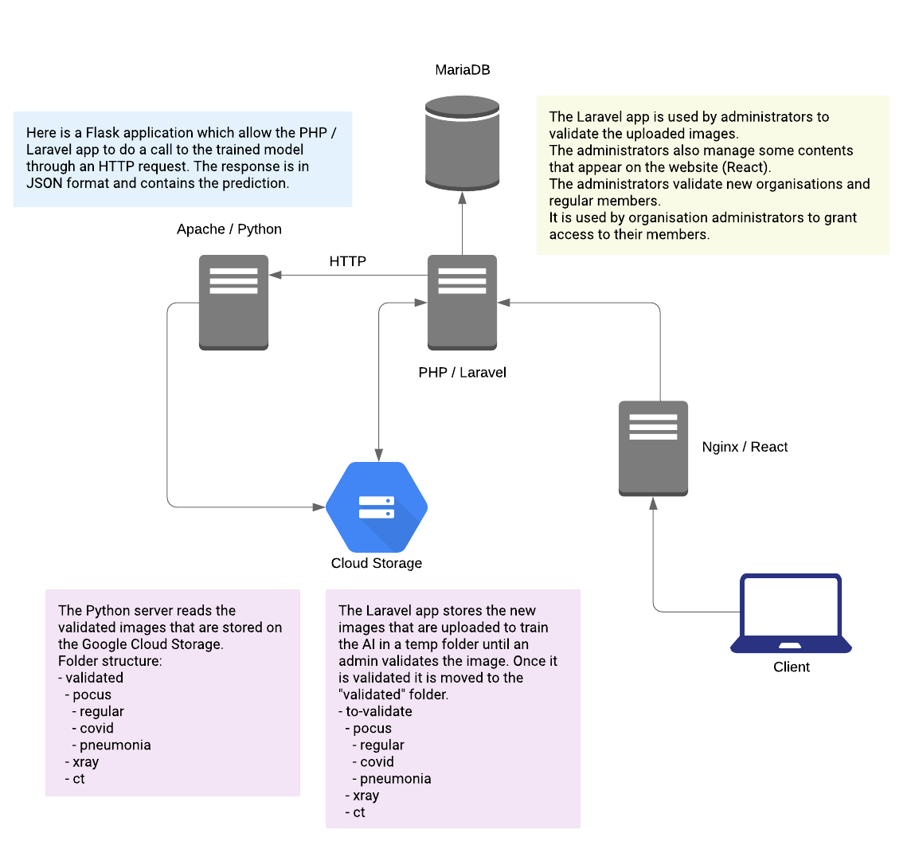
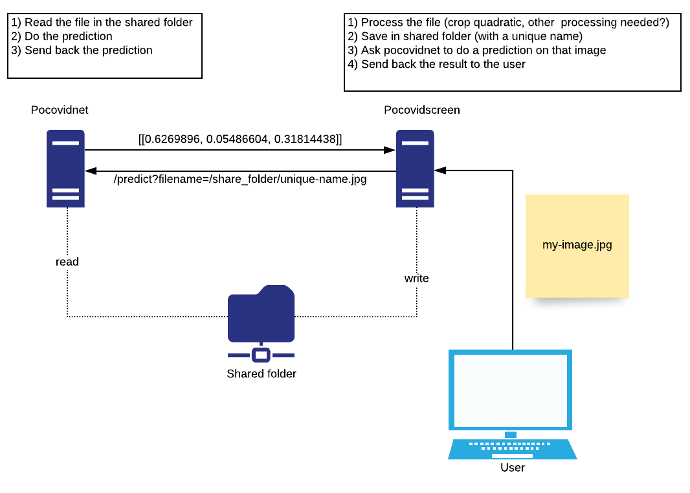

## Infrastructure


### Screening process


## Installation (web application)

To use the trained model with our web application *locally* follow those steps :

- Clone the repo
- Start the containers with [ddev](https://ddev.readthedocs.io/en/stable/) (will automatically install composer dependencies)

```bash
ddev start
```

- Install npm dependencies

```bash
npm install
```

- Copy .env.example to .env

```bash
cp .env.example .env
```

- Generate app key

```bash
ddev exec php artisan key:generate
```

- Run database migration

```bash
ddev exec php artisan migrate:fresh
```

- Generate JWT secret

```bash
ddev exec php artisan jwt:secret
```

- Start npm watcher to start coding
```bash
npm run watch
```

- Or run a build for production
```bash
npm run prod
```

- Visit https://covidscreen.ddev.site/
